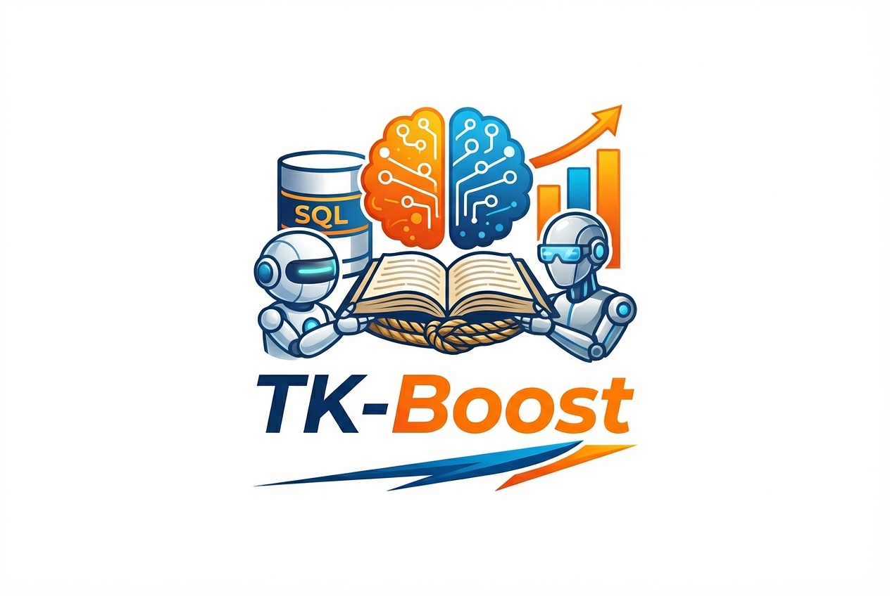

<p align="center">
  
</p>

<h1 align="center">TK-Boost</h1>

<p align="center">
  <strong>Arming Data Agents with Tribal Knowledge</strong>
</p>

<p align="center">
  <a href="https://arxiv.org/abs/2602.13521">
    
  </a>
  <a href="https://skejriwal44.github.io/TK-Boost/">
    
  </a>
  <a href="https://skejriwal44.github.io/TK-Boost/blog.html">
    
  </a>
  <a href="LICENSE">
    
  </a>
</p>

<p align="center">
  <em>Shubham Agarwal &middot; Asim Biswal &middot; Sepanta Zeighami &middot; Alvin Cheung &middot; Joseph Gonzalez &middot; Aditya G. Parameswaran</em><br>
  <em>UC Berkeley</em>
</p>

---

**TK-Boost** is a bolt-on framework for augmenting any NL2SQL agent with **tribal knowledge** — reusable corrective knowledge that fixes the agent's recurring misconceptions about real-world databases, learned from experience.

> NL2SQL agents already know how to write SQL. What they lack is experience using real databases. Tribal knowledge fills that gap.

### Key Results

| Benchmark | Accuracy Gain |
|:---|:---|
| **Spider 2.0** | **+16.9%** |
| **BIRD** | **+13.7%** |
| **ReFORCE** (bolt-on to SOTA) | **+11.4%** |
| **Agentar-Scale SQL** (bolt-on to SOTA) | **+10.2%** |

---

## Features

- **Bolt-On Design** — works with any NL2SQL agent, no retraining needed
- **Multi-Database** — SQLite, Snowflake, and BigQuery with automatic engine detection
- **CTE-Level Correction** — applies knowledge one CTE at a time for precise fixes
- **SQL-Based Retrieval** — retrieves knowledge from the SQL draft using structured applicability conditions
- **Predicted Hints** — LLM-generated table/column predictions and CTE briefs
- **Parallel Execution** — batch-process instances concurrently

---

## Quick Start

```bash
git clone https://github.com/abiswal2001/TK-Boost.git
cd TK-Boost
python3 -m venv env && source env/bin/activate
pip install -r requirements.txt
```

```bash
# Run the SQL agent on a single instance
python src/agents/sql_agent_runner.py \
  --instance-id local066 \
  --jsonl-path data/spider2-lite.jsonl \
  --model azure/gpt-4.1 \
  --out-base outputs/baseline \
  --verbose
```

See **`demo.ipynb`** for a full end-to-end walkthrough.

---

## Usage

<details>
<summary><strong>Run with Predicted Hints</strong></summary>

```bash
python src/agents/sql_agent_runner.py \
  --instance-id local066 \
  --jsonl-path data/spider2-lite.jsonl \
  --model azure/gpt-4.1 \
  -c data/contexts/predicted_cte_briefs_local.csv \
  -t data/contexts/predicted_tablescols_local.csv \
  --out-base outputs/local_with_hints \
  --verbose
```
</details>

<details>
<summary><strong>Run Multiple Instances</strong></summary>

```bash
python src/agents/sql_agent_runner.py \
  --instance-id local066 \
  --instance-id local065 \
  --instance-id local022 \
  --jsonl-path data/spider2-lite.jsonl \
  --model azure/gpt-4.1 \
  --out-base outputs/local_baseline \
  --verbose
```

Or run all instances from the JSONL file:

```bash
python src/agents/sql_agent_runner.py \
  --run-all-from-file \
  --jsonl-path data/spider2-lite.jsonl \
  --model azure/gpt-4.1 \
  --out-base outputs/all_baseline \
  --verbose
```
</details>

<details>
<summary><strong>Snowflake Instances</strong></summary>

The agent auto-detects Snowflake instances (prefix `sf`):

```bash
python src/agents/sql_agent_runner.py \
  --instance-id sf001 \
  --instance-id sf002 \
  --jsonl-path data/spider2-lite.jsonl \
  --model azure/gpt-4.1 \
  -c data/contexts/predicted_cte_briefs_snowflake_azure_o3.csv \
  -t data/contexts/predicted_tablescols_snowflake_azure_o3.csv \
  --out-base outputs/snowflake_baseline \
  --verbose
```

**Credentials:** Configure via `~/.snowflake/config` or environment variables:
```bash
export SNOWFLAKE_ACCOUNT="your_account"
export SNOWFLAKE_USER="your_user"
export SNOWFLAKE_PASSWORD="your_password"
export SNOWFLAKE_WAREHOUSE="your_warehouse"
```
</details>

<details>
<summary><strong>BigQuery Instances</strong></summary>

The agent auto-detects BigQuery instances (prefix `bq` or `ga`):

```bash
python src/agents/sql_agent_runner.py \
  --instance-id bq001 \
  --instance-id ga001 \
  --jsonl-path data/spider2-lite.jsonl \
  --model azure/gpt-4.1 \
  -c data/contexts/predicted_cte_briefs_bigquery_azure_o3.csv \
  -t data/contexts/predicted_tablescols_bigquery_azure_o3.csv \
  --out-base outputs/bigquery_baseline \
  --verbose
```

**Credentials:** Configure via Google Cloud SDK:
```bash
gcloud auth application-default login
# Or use service account JSON
export GOOGLE_APPLICATION_CREDENTIALS="/path/to/service-account-key.json"
```
</details>

<details>
<summary><strong>CTE Refiner (Validation)</strong></summary>

The CTE refiner iteratively validates and improves each CTE, then refines the final SELECT:

```bash
python src/agents/sql_agent_runner.py \
  --instance-id local066 \
  --jsonl-path data/spider2-lite.jsonl \
  --model azure/gpt-4.1 \
  -c data/contexts/predicted_cte_briefs_local.csv \
  -t data/contexts/predicted_tablescols_local.csv \
  --validate-cte \
  --out-base outputs/local_validated \
  --verbose
```

**How it works:**
1. Agent generates initial SQL solution
2. SQL is parsed into CTEs and final SELECT
3. Each CTE is validated individually (max 25 turns)
4. Refiner suggests fixes, agent revises
5. Final SELECT validated with all CTEs
6. Validated SQL and results saved

**Output files:**
```
outputs/local066_20251031_120000/
├── execution_query.sql              # Original agent SQL
├── execution_result.csv             # Original agent results
├── execution_query_validated.sql    # SQL after validation
├── execution_result_validated.csv   # Results after validation
├── refiner_cte1.json                # Refiner verdict per CTE
├── refiner_cte1_trace.txt           # Refinement trace per CTE
├── refiner_final_select.json        # Final SELECT verdict
├── messages.json                    # Full conversation history
├── processed_trace.txt              # Human-readable trace
├── gt_query.sql                     # Ground truth SQL
└── gt_result.csv                    # Ground truth results
```
</details>

<details>
<summary><strong>Validation-Only Mode</strong></summary>

Run the refiner on existing outputs without regenerating agent responses:

```bash
python src/agents/sql_agent_runner.py \
  --validate-output outputs/snowflake_norefiner \
  --jsonl-path data/spider2-lite.jsonl \
  --model azure/gpt-4.1 \
  -c data/contexts/predicted_cte_briefs_snowflake_azure_o3.csv \
  -t data/contexts/predicted_tablescols_snowflake_azure_o3.csv \
  --verbose
```
</details>

<details>
<summary><strong>Parallel Execution</strong></summary>

```bash
python scripts/run_snowflake_parallel.py \
  --jsonl-path data/spider2-lite.jsonl \
  --model azure/gpt-4.1 \
  -c data/contexts/predicted_cte_briefs_snowflake_azure_o3.csv \
  -t data/contexts/predicted_tablescols_snowflake_azure_o3.csv \
  --out-base outputs/snowflake_validated \
  --workers 3 \
  --timeout 600 \
  --verbose
```
</details>

<details>
<summary><strong>Generating Predicted Hints</strong></summary>

**Tables/Columns:**
```bash
# SQLite
python generate_predicted_tables_columns.py \
  --jsonl-path data/spider2-lite.jsonl \
  --taxonomy-csv data/contexts/sql_nl_summaries_taxonomy.csv \
  --out-csv data/contexts/predicted_tablescols_local.csv \
  --model azure/o3 --engine sqlite --verbose

# Snowflake
python generate_predicted_tables_columns.py \
  --jsonl-path data/spider2-lite.jsonl \
  --taxonomy-csv data/contexts/sql_nl_summaries_taxonomy.csv \
  --out-csv data/contexts/predicted_tablescols_snowflake_azure_o3.csv \
  --model azure/o3 --engine snowflake --all-snowflake-from-jsonl --verbose

# BigQuery
python generate_predicted_tables_columns.py \
  --jsonl-path data/spider2-lite.jsonl \
  --taxonomy-csv data/contexts/sql_nl_summaries_taxonomy.csv \
  --out-csv data/contexts/predicted_tablescols_bigquery_azure_o3.csv \
  --model azure/o3 --engine bigquery --all-bigquery-from-jsonl --verbose
```

**CTE Briefs:**
```bash
# SQLite
python generate_predicted_cte_briefs.py \
  --jsonl-path data/spider2-lite.jsonl \
  --taxonomy-csv data/contexts/sql_nl_summaries_taxonomy.csv \
  --analysis-csv data/contexts/sql_nl_summaries_taxonomy_analysis_of_summary_results.csv \
  --predicted-tables-cols-csv data/contexts/predicted_tablescols_local.csv \
  --out-csv data/contexts/predicted_cte_briefs_local.csv \
  --model azure/o3 --restrict-to-predicted --no-analysis-filter --verbose

# Snowflake (with external knowledge)
python generate_predicted_cte_briefs.py \
  --jsonl-path data/spider2-lite.jsonl \
  --taxonomy-csv data/contexts/sql_nl_summaries_taxonomy.csv \
  --analysis-csv data/contexts/sql_nl_summaries_taxonomy_analysis_of_summary_results.csv \
  --predicted-tables-cols-csv data/contexts/predicted_tablescols_snowflake_azure_o3.csv \
  --out-csv data/contexts/predicted_cte_briefs_snowflake_azure_o3.csv \
  --model azure/o3 --include-external-knowledge --external-knowledge-root data/spider2 \
  --snowflake-ids-only --restrict-to-predicted --no-analysis-filter --verbose

# BigQuery (with external knowledge)
python generate_predicted_cte_briefs.py \
  --jsonl-path data/spider2-lite.jsonl \
  --taxonomy-csv data/contexts/sql_nl_summaries_taxonomy.csv \
  --analysis-csv data/contexts/sql_nl_summaries_taxonomy_analysis_of_summary_results.csv \
  --predicted-tables-cols-csv data/contexts/predicted_tablescols_bigquery_azure_o3.csv \
  --out-csv data/contexts/predicted_cte_briefs_bigquery_azure_o3.csv \
  --model azure/o3 --include-external-knowledge --external-knowledge-root data/spider2 \
  --bigquery-ids-only --restrict-to-predicted --no-analysis-filter --verbose
```

**Schema Contexts (Snowflake / BigQuery):**
```bash
python scripts/precompute_snowflake_db_contexts.py   # Creates data/sf_schemas/*.txt
python scripts/create_bq_schema_contexts.py           # Creates data/bq_schemas/*.txt
```
</details>

---

## Configuration

<details>
<summary><strong>LLM Provider</strong></summary>

Edit `src/utils/auth.py`:

```python
# Azure OpenAI
os.environ["AZURE_API_KEY"] = "your-key"
os.environ["AZURE_API_BASE"] = "https://your-endpoint.openai.azure.com/"
os.environ["AZURE_API_VERSION"] = "2024-12-01-preview"

# Or OpenAI
os.environ["OPENAI_API_KEY"] = "your-key"
```

System prompts are in `src/agents/prompts.py`:
- `BASE_PROMPT` — SQLite instances
- `SNOWFLAKE_PROMPT` — Snowflake instances (syntax & case-sensitivity notes)
</details>

---

## Evaluation

```bash
cd evaluation
python evals.py \
  --mode exec_result \
  --result_dir ../outputs/snowflake_validated \
  --gold_dir ../data/spider2/gold
```

**Output:** `evals.csv` (scores per instance), `correct_ids.csv` (passing instances), and summary statistics.

---

## Citation

```bibtex
@article{agarwal2025arming,
  title={Arming Data Agents with Tribal Knowledge},
  author={Agarwal, Shubham and Biswal, Asim and Zeighami, Sepanta and Cheung, Alvin and Gonzalez, Joseph and Parameswaran, Aditya G.},
  journal={arXiv preprint arXiv:2602.13521},
  year={2025}
}
```

## License

MIT License — See [LICENSE](LICENSE) for details.
